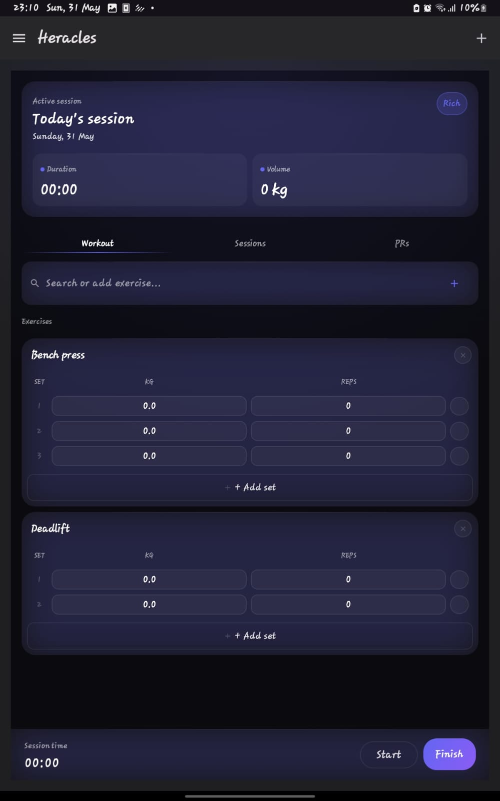

# Heracles

**A lightweight, local-first workout logger for Android — no accounts, no tracking, no subscriptions.**

Heracles keeps workout data on-device, built with Kotlin and Jetpack Compose. It's the mobile companion to the desktop ecosystem project, Hercules.

## Features

- Fast workout logging for exercises, sets, reps, weights, bodyweight, and duration
- Local session save, restore, export, and autosave behavior
- Custom theme modpacks with light/dark scheme support and style controls
- Pre-built session import flow with inbox-style review before loading into Logger
- Tracker screen for bodyweight and volume trends
- Offline-first storage with atomic JSON writes

## Screenshots

| Logger (Rich theme) | Tracker (Rich theme) |
|---|---|
|  |  |

Default Material theme, for comparison

## Installation

Updates are distributed through GitHub Releases.

1. Open the [latest release](../../releases/latest) on GitHub.
2. Download the release APK.
3. Install it on your Android device.
4. Enable unknown-source installs if Android prompts for it.
5. In Settings, select the **Rich** theme for the fully verified experience (see Status below).

## Status

Heracles supports multiple UI configurations (**Rich**, Balanced, Minimal, Custom). **Rich is the only configuration currently verified end-to-end** — that's the build to use if you're trying the app today. The other modes are present in the codebase but still in active development.

Core logging, session storage, and the math/parsing logic are covered by **23 unit tests across 8 test files** (`AppViewModelTest`, `SessionRepositoryTest`, `WorkoutLogicTest`, `NumericInputEdgeCasesTest`, and others under `app/src/test`). The Tracker screen (radar chart, volume/bodyweight trends) renders correctly but its underlying load-distribution calculations haven't been independently verified yet — treat tracker numbers as provisional.

## Tech Stack

- Kotlin
- Jetpack Compose Material 3
- Kotlin Coroutines and StateFlow
- Local JSON serialization

## Roadmap

- Verifying Balanced, Minimal, and Custom UI modes to the same standard as Rich
- Validating Tracker load-distribution calculations
- Richer pre-built text parsing and friendlier import formatting
- Time-related logging UI
- Notes support inside sessions

Full roadmap tracked in [PLANNED_CHANGES.md](PLANNED_CHANGES.md).

## Notes

- Data is stored locally on the device; the app is designed for fast on-device iteration and offline use.

## Legacy Notes

Earlier versions of this README used a more marketing-style feature list and installation blurb. The current version keeps the same project intent but reflects the newer theme modpack, pre-built session, and logger work that is now in the codebase.
