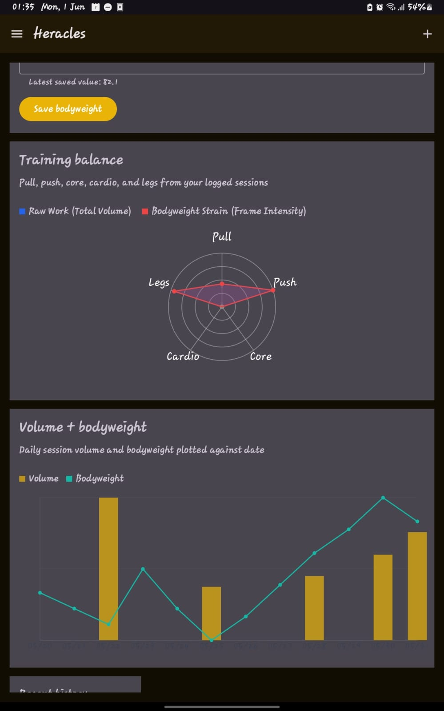
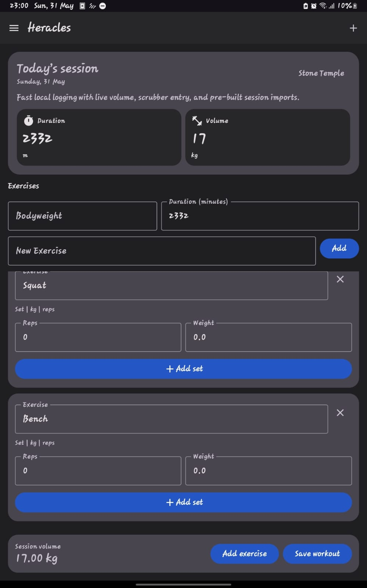
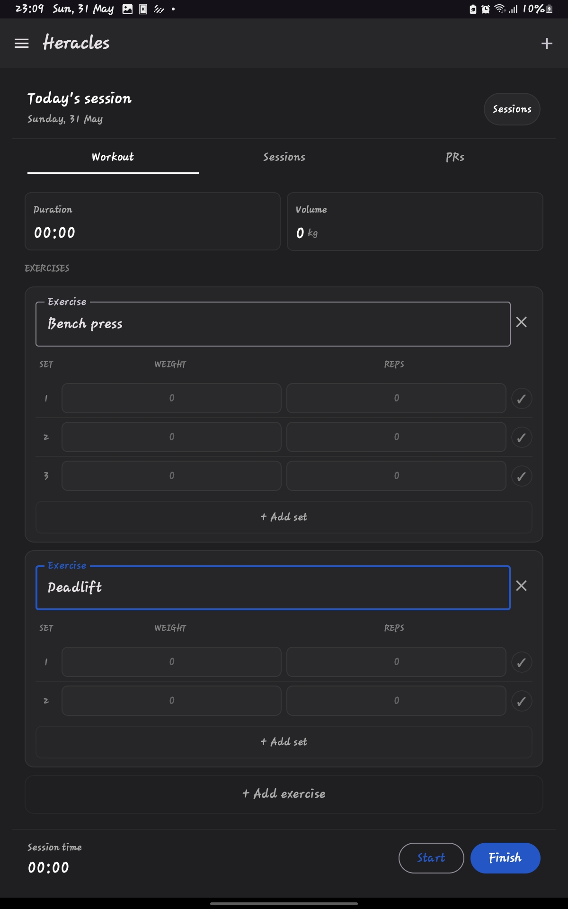

# Heracles

**A lightweight, local-first workout logger for Android — no accounts, no tracking, no subscriptions.**

Heracles keeps workout data on-device, built with Kotlin and Jetpack Compose. It's the mobile companion to the desktop ecosystem project, Hercules.

## Features

- Fast workout logging for exercises, sets, reps, weights, bodyweight, and duration
- Local session save, restore, export, and autosave behavior
- Custom theme modpacks with light/dark scheme support and style controls
- Pre-built session import flow with inbox-style review before loading into Logger
- Tracker screen for bodyweight and volume trends
- Offline-first storage with atomic JSON writes

## Screenshots

| Logger (Rich tier) | Tracker  |
|---|---|
|  |  |

Other tiers, for comparison

## Installation

Updates are distributed through GitHub Releases.

1. Open the [latest release](../../releases/latest) on GitHub.
2. Download the release APK.
3. Install it on your Android device.
4. Enable unknown-source installs if Android prompts for it.
5. In Settings, select the **Rich** theme for the fully verified experience (see Status below).

## Status

Heracles supports multiple UI configurations (**Rich**, Balanced, Minimal, Custom). **Rich is the only configuration currently verified end-to-end** — that's the build to use if you're trying the app today. The other modes are present in the codebase but still in active development.

**What's tested (23 tests, 8 files under `app/src/test`):**
- Session persistence — real round-trip save/load/delete against actual temp-directory file I/O (not mocked), including unique-filename collision handling and storage-path migration
- Numeric input sanitization — adversarial inputs (`"-"`, `"."`, mixed garbage, multi-decimal strings) and drag-to-scrub precision
- Pre-built workout template parsing — both the happy path and an explicit rejection case (a set declared before any exercise) with an exact expected error message
- Core volume calculation and session filename generation

**What's implemented but not yet functional:** the Tracker's formula layer (`HerculesMathEngine.kt`) — Epley-based 1RM estimation, a derived effort-adjustment factor, dual AVI/RVI volume indices, and a 30-day rolling axis-weighting system — is fully designed and coded. What it's currently missing is the data it depends on: per-exercise muscle-load distribution (which axis an exercise loads, and by what percentage). Right now this falls back to ~40 hardcoded keyword matches (e.g. `"squat"` → 100% Legs), which is a placeholder, not real data. An ~8,000-entry exercise database (covering variants) with proper load-distribution values is planned to replace this — once that lands, the formula has the real input it was designed for. Treat Tracker output as provisional until then.

Storage uses atomic writes (write-to-temp-file, then rename) with `runCatching`-wrapped fallbacks throughout, so corrupt or missing data files degrade gracefully instead of crashing the app — this is implemented, not just claimed.

## Tech Stack

- Kotlin
- Jetpack Compose Material 3
- Kotlin Coroutines and StateFlow
- Local JSON serialization

## Roadmap

- Verifying Balanced, Minimal, and Custom UI modes to the same standard as Rich
- Building an ~8,000-entry exercise database (with variants) to supply real per-exercise muscle-load distribution data, replacing the current keyword-fallback so the Tracker's AVI/RVI formula has the input it was designed for
- Richer pre-built text parsing and friendlier import formatting
- Time-related logging UI
- Notes support inside sessions

Full roadmap tracked in [PLANNED_CHANGES.md](PLANNED_CHANGES.md).

## Notes

- Data is stored locally on the device; the app is designed for fast on-device iteration and offline use.
- May our muscles grow in size and our strength double